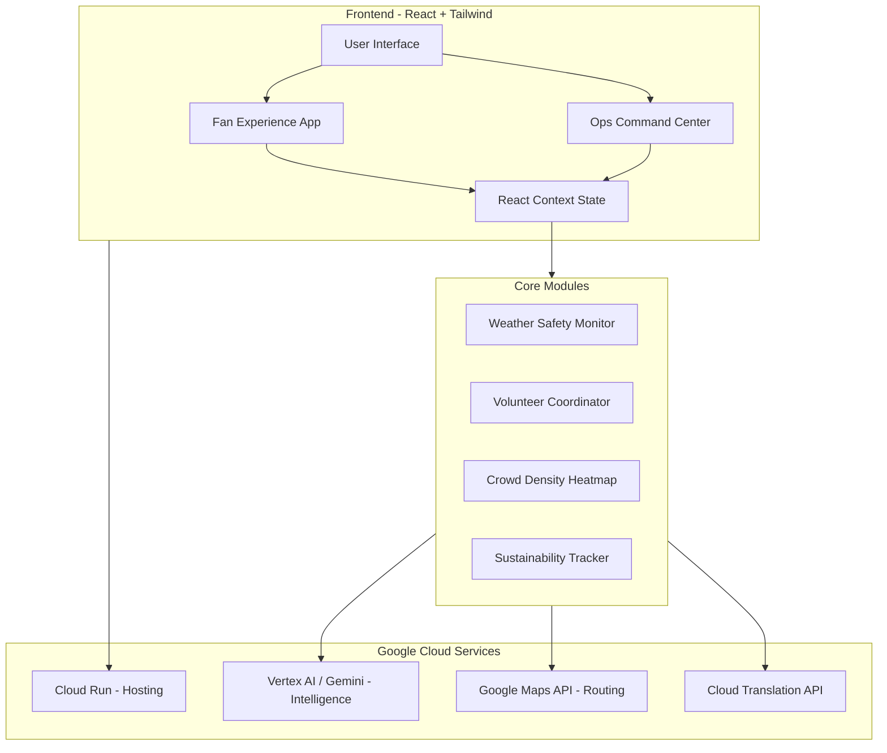

# 🏟️ FIFA World Cup 2026 Smart Stadium Platform


The **FIFA World Cup 2026 Smart Stadium Platform** is a next-generation operational and fan-experience application designed for the unique challenges of the 2026 World Cup hosted across the USA, Mexico, and Canada. This platform brings together navigation, real-time telemetry, advanced AI decision support, robust accessibility features, and sustainability tracking into a single cohesive command center and fan portal. It ensures the safety, efficiency, and ultimate experience for millions of global fans.

---

## 🎯 Challenge Alignment Matrix

This project directly addresses the core challenges of modern, large-scale stadium events. Every feature is meticulously mapped to a specific operational requirement:

| Challenge Category | Platform Features & Implementations |
|--------------------|--------------------------------------|
| **Navigation** | • **Stadium Map**: Interactive 3D visualization of the stadium.<br/>• **Audio Beacons**: Spatial audio guidance for visually impaired users.<br/>• **Turn-by-turn Routing**: Dynamic pathfinding avoiding congested areas.<br/>• **Gate Directions**: Optimal entry/exit gate recommendations. |
| **Crowd Management** | • **Crowd Density Heatmap**: Real-time radar view of crowd congestion.<br/>• **CCTV Vision AI**: Automated monitoring of crowd behavior and anomalies.<br/>• **Gate Congestion Alerts**: Proactive notifications to redirect traffic.<br/>• **Match Timeline Simulator**: Predictive crowd flow based on match events. |
| **Accessibility** | • **WCAG 2.1 AA Compliance**: Strict adherence to accessibility standards.<br/>• **High Contrast & OpenDyslexic Font**: UI toggles for visual impairments.<br/>• **Voice Commands**: Hands-free navigation and feature access.<br/>• **Audio Beacons**: Proximity-based audio cues.<br/>• **Color Blindness Filters**: Customizable display modes.<br/>• **Screen Reader ARIA**: Semantic HTML and ARIA labels. |
| **Transportation** | • **Smart Parking Router**: Live parking availability and guidance.<br/>• **EV Shuttle Tracker**: Real-time location of zero-emission shuttles.<br/>• **Eco Transit Points**: Highlighting sustainable travel options.<br/>• **Transit Gate Directions**: Guiding fans to public transit hubs. |
| **Sustainability** | • **EcoGoal Rewards System**: Gamified eco-friendly behavior tracking.<br/>• **Reusable Cup Points**: Incentivizing waste reduction.<br/>• **Zero-Emission Transit Bonuses**: Points for taking public transit.<br/>• **Eco-Certified Concessions**: Highlighting sustainable food options. |
| **Multilingual Assistance** | • **10+ Language AI Companion**: Gemini-powered conversational assistant.<br/>• **Speech-to-Text**: Real-time transcription in multiple languages.<br/>• **PA Announcements**: Automated broadcast translation in English, Spanish, French.<br/>• **Auto-Translation**: Dynamic UI translation based on user preference. |
| **Operational Intelligence** | • **Incident Dispatcher**: Rapid response coordination system.<br/>• **Volunteer Coordinator**: Task management for stadium volunteers.<br/>• **PA Broadcast System**: Centralized emergency and informational audio.<br/>• **Telemetry HUD**: Real-time metrics dashboard.<br/>• **Weather Safety Monitor**: Critical environmental tracking. |
| **Real-Time Decision Support** | • **Gemini CCTV Vision Analysis**: AI parsing of security feeds.<br/>• **Queue Predictive Algorithms**: Forecasting wait times.<br/>• **Gate Overflow Recommendations**: AI-driven crowd redirection.<br/>• **Emergency SOS Beacon**: Instant distress signaling.<br/>• **Weather Risk Alerts**: Automated safety protocols for extreme heat. |

---

## 🏗️ Architecture Diagram



---

## ☁️ Google Services Integration

The platform leverages the power of Google Cloud to deliver scalable and intelligent features:

1. **Vertex AI (Gemini Pro/Vision)**: Powers the Multilingual AI Companion, CCTV Vision Analysis, and automated decision support recommendations for crowd management and weather safety.
2. **Google Maps Platform**: Provides the foundation for the Smart Parking Router, EV Shuttle Tracker, and Turn-by-turn Routing within and around the stadium footprint.
3. **Google Cloud Translation API**: Enables real-time, accurate translation for the PA Announcements and UI localization (English, Spanish, French).
4. **Google Cloud Run**: Ensures highly scalable, containerized deployment capable of handling massive traffic spikes during match days.
5. **Google Cloud Logging/Monitoring**: Underlying telemetry for the Ops Command Center.

---

## 💻 Tech Stack

- **Framework**: React 18 with TypeScript
- **Styling**: Tailwind CSS (Glassmorphism design system)
- **Icons**: Lucide React
- **State Management**: React Context API
- **Tooling**: Vite, ESLint, PostCSS
- **Deployment**: Docker, Google Cloud Run

---

## 🚀 Quick Start

1. **Clone the repository**
   ```bash
   git clone https://github.com/your-org/fifa-smart-stadium.git
   cd fifa-smart-stadium
   ```

2. **Install dependencies**
   ```bash
   npm install
   ```

3. **Set up environment variables**
   Create a `.env` file in the root directory:
   ```env
   VITE_GOOGLE_MAPS_API_KEY=your_maps_key
   VITE_GEMINI_API_KEY=your_gemini_key
   ```

4. **Start the development server**
   ```bash
   npm run dev
   ```
   The application will be available at `http://localhost:5173`.

---

## 🧪 Testing

Run the test suite to ensure all components and utilities are functioning correctly:

```bash
# Run unit tests
npm run test

# Run tests with coverage report
npm run test:coverage

# Run end-to-end tests
npm run e2e
```

---

## 📦 Deployment

### Vercel
The easiest way to deploy the frontend is via Vercel:
```bash
npm i -g vercel
vercel
```

### Docker & Cloud Run
For enterprise deployment on Google Cloud Run:

1. **Build the container**
   ```bash
   docker build -t gcr.io/your-project/smart-stadium:latest .
   ```

2. **Push to Google Container Registry**
   ```bash
   docker push gcr.io/your-project/smart-stadium:latest
   ```

3. **Deploy to Cloud Run**
   ```bash
   gcloud run deploy smart-stadium \
     --image gcr.io/your-project/smart-stadium:latest \
     --platform managed \
     --region us-central1 \
     --allow-unauthenticated
   ```
